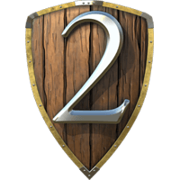

<!--
*** Thanks for checking out the Best-README-Template. If you have a suggestion
*** that would make this better, please fork the repo and create a pull request
*** or simply open an issue with the tag "enhancement".
*** Thanks again! Now go create something AMAZING! :D
***
***
***
*** To avoid retyping too much info. Do a search and replace for the following:
*** github_username, repo_name, twitter_handle, email, project_title, project_description
-->


<!-- PROJECT SHIELDS -->
<!--
*** I'm using markdown "reference style" links for readability.
*** Reference links are enclosed in brackets [ ] instead of parentheses ( ).
*** See the bottom of this document for the declaration of the reference variables
*** for contributors-url, forks-url, etc. This is an optional, concise syntax you may use.
*** https://www.markdownguide.org/basic-syntax/#reference-style-links
-->
[![Product Name Screen Shot][product-screenshot]]


<!-- PROJECT LOGO -->
<br />
<p align="center">
  <a href="https://github.com/adinokd6/Stronghold_Hack">
    
  </a>

  <h3 align="center">Stronghold 2 Resources Hack</h3>


<!-- TABLE OF CONTENTS -->
<details open="open">
  <summary><h2 style="display: inline-block">Table of Contents</h2></summary>
  <ol>
    <li>
    <a href="#built-with">Built With</a>
    </li>
    <li>
      <a href="#getting-started">Getting Started</a>
      <ul>
        <li><a href="#installation">Installation</a></li>
      </ul>
    </li>
    <li><a href="#usage">Usage</a></li>
    <li><a href="#roadmap">Roadmap</a></li>
    <li><a href="#contributing">Contributing</a></li>
    <li><a href="#contact">Contact</a></li>
  </ol>
</details>


### Built With

* [Visual studio and C++](https://visualstudio.microsoft.com/pl/)
* [WxWidgets](https://www.wxwidgets.org/)


<!-- GETTING STARTED -->
## Getting Started

To get a local copy up and running follow these simple steps.


### Installation - WORK ONLY FOR WINDOWS!

1. Clone the repo
   ```sh
   git clone https://github.com/adinokd6/Stronghold_Hack.git
   ```
2. Build
3. Run exe file.


<!-- USAGE EXAMPLES -->
## Usage
Program can be used to add sources, armour etc. during your single-player game in Stronghold 2. It can be used either on 1.4.1 or 1.5.0 Steam version of the game. First you need to choose version of your game. In next step type the value you want to have in game and if everything is ready click HACK button. Well! You've done it. If everything gone well you can enjoy the increased condition of your castle.


<!-- ROADMAP -->
## Roadmap

See the [open issues](https://github.com/github_username/repo_name/issues) for a list of proposed features (and known issues).


<!-- CONTRIBUTING -->
## Contributing

Contributions are what make the open source community such an amazing place to be learn, inspire, and create. Any contributions you make are **greatly appreciated**.

1. Fork the Project
2. Create your Feature Branch (`git checkout -b feature/AmazingFeature`)
3. Commit your Changes (`git commit -m 'Add some AmazingFeature'`)
4. Push to the Branch (`git push origin feature/AmazingFeature`)
5. Open a Pull Request


<!-- CONTACT -->
## Contact

Your Name - Adrian
Email - adinokd66@gmail.com

Project Link: [https://github.com/github_username/repo_name](https://github.com/github_username/repo_name)


<!-- MARKDOWN LINKS & IMAGES -->
<!-- https://www.markdownguide.org/basic-syntax/#reference-style-links -->
[contributors-shield]: https://img.shields.io/github/contributors/adinokd6/repo.svg?style=for-the-badge
[contributors-url]: https://github.com/adinokd6/repo/graphs/contributors
[forks-shield]: https://img.shields.io/github/forks/adinokd6/repo.svg?style=for-the-badge
[forks-url]: https://github.com/adinokd6/repo/network/members
[stars-shield]: https://img.shields.io/github/stars/adinokd6/repo.svg?style=for-the-badge
[stars-url]: https://github.com/adinokd6/repo/stargazers
[issues-shield]: https://img.shields.io/github/issues/adinokd6/repo.svg?style=for-the-badge
[issues-url]: https://github.com/adinokd6/repo/issues
[license-shield]: https://img.shields.io/github/license/adinokd6/repo.svg?style=for-the-badge
[license-url]: https://github.com/adinokd6/repo/blob/master/LICENSE.txt
[linkedin-shield]: https://img.shields.io/badge/-LinkedIn-black.svg?style=for-the-badge&logo=linkedin&colorB=555
[linkedin-url]: https://linkedin.com/in/adinokd6
[product-screenshot]: images/screenshot.png
